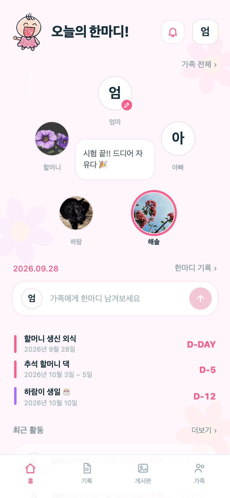
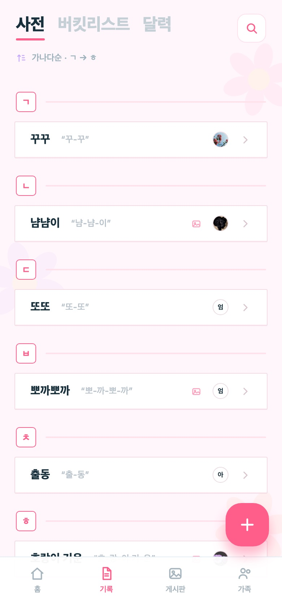
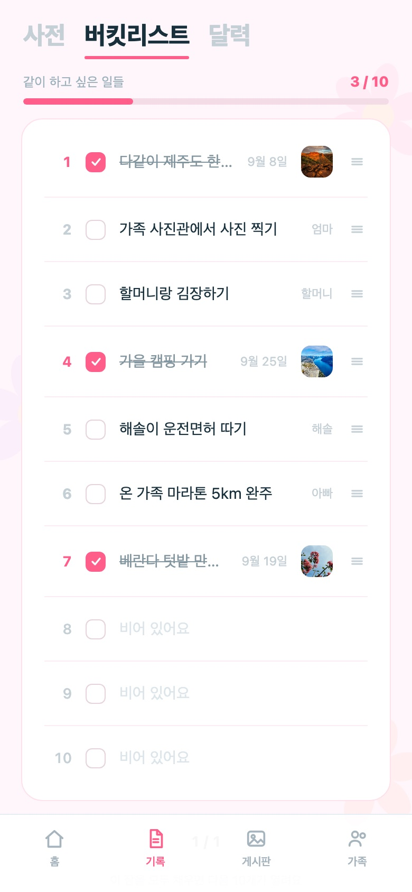
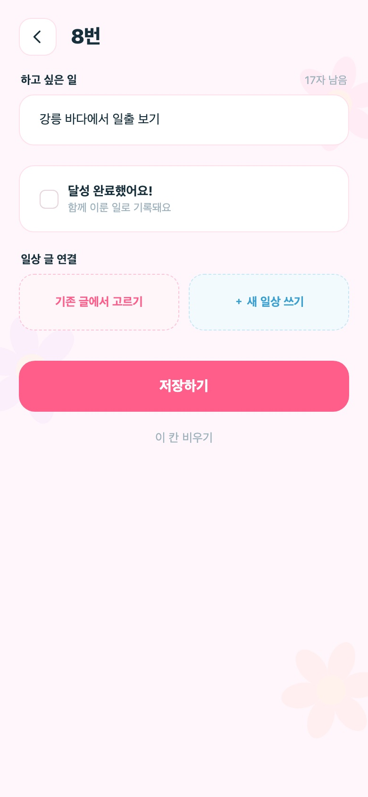
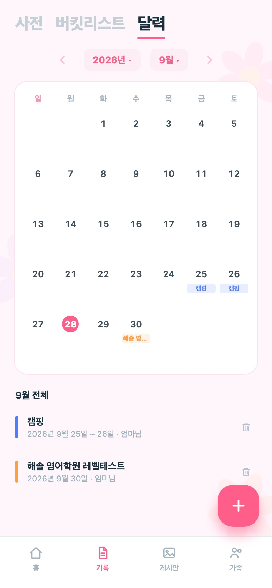
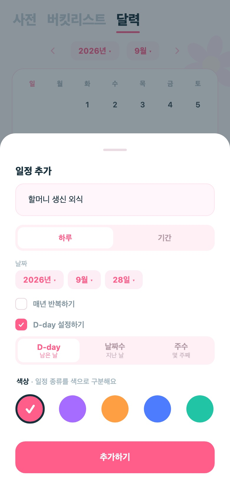
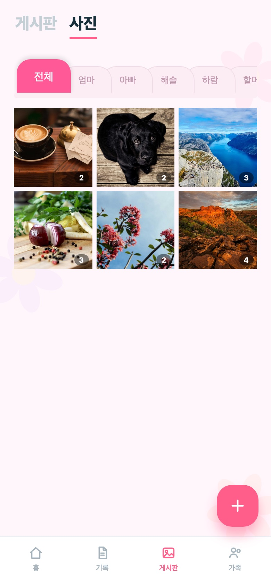
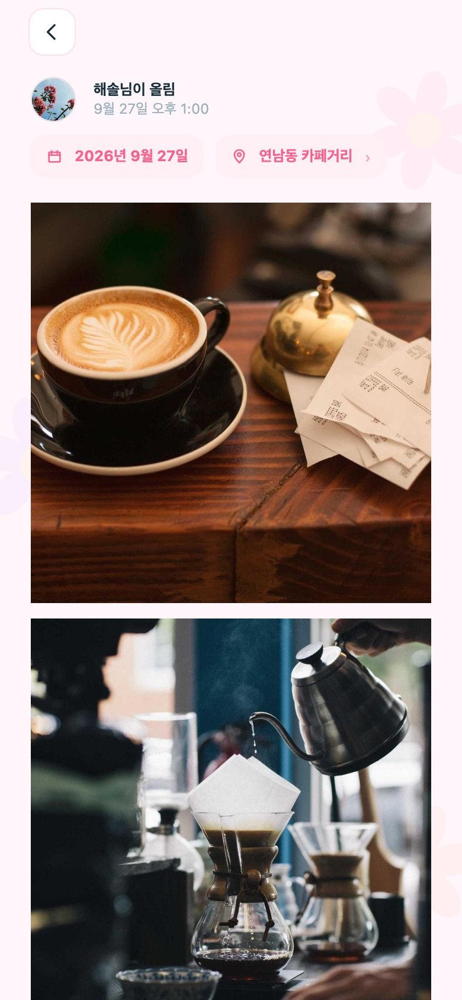
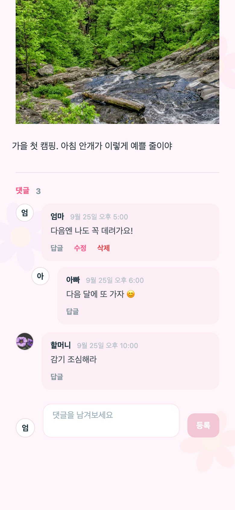
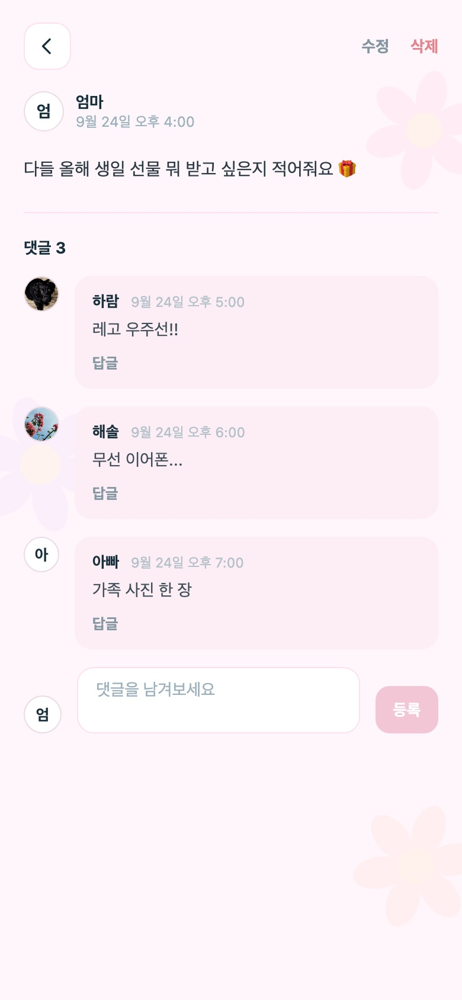

# fam-daily-backend
### 우리 가족끼리만 쓰는 단어, 일상, 이야기를 한 곳에 모읍니다.

#### 👨‍👩‍👧 가족앱 **우리끼리**의 백엔드 API 서버입니다.

- 카카오로 로그인하고, 초대 코드 하나로 가족 공간에 들어옵니다.
- 가족 사전·일상 사진·게시판·버킷리스트·달력·오늘의 한마디를 **가족 단위로 나눠 저장합니다.**
- 가족마다 호칭과 프로필 사진을 따로 둘 수 있어, 한 사람이 여러 가족에 속해도 각자의 이름으로 보입니다.

## 배포 주소

[**API 문서(Swagger) 보기 →**](https://web-production-cb610.up.railway.app/api/docs)

- **API** — `https://web-production-cb610.up.railway.app/api`
- **웹 앱** — [woorikkiri-jade.vercel.app](https://woorikkiri-jade.vercel.app) ([fam-daily-frontend](https://github.com/wjdwwidz/fam-daily-frontend))
- **공개 문서** — [`/privacy`](https://web-production-cb610.up.railway.app/privacy) 개인정보 처리방침, [`/account-deletion`](https://web-production-cb610.up.railway.app/account-deletion) 계정 삭제 안내

`main` 에 push 하면 Railway 가 새로 빌드해 배포합니다.
서버가 뜰 때 아직 적용되지 않은 마이그레이션을 먼저 실행하므로, 배포와 DB 변경이 한 번에 반영됩니다.

## 화면
이 API 로 동작하는 앱 화면입니다.

| 홈 | 가족 사전 |
|---|---|
|  |  |

홈에서는 가족들의 오늘의 한마디, 다가오는 D-day, 최근 활동을 한 번에 봅니다.
사전에는 우리 가족만 쓰는 말이 가나다순으로 쌓입니다.

| 버킷리스트 | 빈 칸 채우기 |
|---|---|
|  |  |

버킷리스트는 빈 번호 칸을 골라 하고 싶은 일을 적습니다.
이룬 칸은 체크하고 그날의 일상 글을 연결하면, 목록에 사진이 함께 붙습니다.

| 달력 | 일정 추가 |
|---|---|
|  |  |

일정은 하루 또는 기간으로 넣고, 매년 반복과 D-day 를 켤 수 있습니다.
D-day 를 켠 일정은 홈 화면 상단에 가까운 순서로 뜹니다.

| 일상 | 일상 상세 |
|---|---|
|  |  |

사진 여러 장을 글 하나로 올리고, 찍은 날짜와 장소를 붙입니다.

| 댓글 · 답글 | 게시판 |
|---|---|
|  |  |

> 스크린샷은 로컬 서버에 넣은 테스트 데이터로 찍었습니다. 가족과 글은 모두 가상이며,
> 사진은 [Lorem Picsum](https://picsum.photos)(Unsplash 이미지)을 사용했습니다.

## 기능

| 기능 | 경로 | 설명 |
|---|---|---|
| 로그인 | `/auth` | 카카오 로그인(웹 리다이렉트 · 앱 SDK 토큰), 내 정보 수정, 회원 탈퇴 |
| 가족 공간 | `/groups` | 공간 만들기 · 초대 코드 발급 · 참여, 가족별 호칭과 사진 |
| 오늘의 한마디 | `/groups/:id/mood` | 지금 기분 한 줄, 한마디·프로필 변경 기록 |
| 가족 사전 | `/groups/:id/words` | 우리 가족만 쓰는 말과 뜻, 사진 |
| 일상 | `/groups/:id/media` | 사진·영상 최대 20장을 글 하나로, 장소 태그, 댓글·답글 |
| 게시판 | `/groups/:id/posts` | 가족에게 묻고 답하는 글, 댓글·답글 |
| 버킷리스트 | `/groups/:id/bucket` | 번호 칸을 채워 가는 가족 목표, 진행률 |
| 달력 | `/groups/:id/events` | 가족 일정, 매년 반복, 홈에 띄울 D-day |
| 활동 · 알림 | `/groups/:id/activity`, `/notifications` | 가족 최근 활동, 내 글에 달린 댓글·답글 알림 |

전체 요청/응답 형식은 [Swagger 문서](https://web-production-cb610.up.railway.app/api/docs)에서 바로 호출해 볼 수 있습니다.

## 기술 스택

- TypeScript, NestJS 11
- PostgreSQL + TypeORM (마이그레이션으로만 스키마 변경)
- Passport JWT, 카카오 OAuth
- Supabase Storage (사진·영상)
- Google Places API (New) — 장소 검색
- `@nestjs/schedule` — 버려진 업로드 청소
- Swagger (`@nestjs/swagger`)
- Railway (서버·DB), Docker Compose (로컬 DB)

## 사용 방법

1. 카카오로 로그인하면 서버가 JWT 를 발급합니다. 이후 요청은 `Authorization: Bearer <token>` 헤더를 붙입니다.
2. 가족 공간을 만들면 만든 사람이 방장이 되고, 초대 코드를 발급해 가족에게 보냅니다.
   `WEB_APP_URL` 이 설정되어 있으면 `{WEB_APP_URL}/join/코드` 초대 링크도 함께 만들어집니다.
3. 초대받은 가족은 코드와 **이 가족에서 쓸 호칭**(엄마, 첫째 …)을 입력해 참여합니다.
4. 그 뒤로 모든 기록은 가족 공간 단위로 쌓이고, 그 가족의 구성원만 읽고 쓸 수 있습니다.

### 일상 사진 올리기

사진과 영상은 서버를 거치지 않고 **앱에서 스토리지로 바로 올라갑니다.**
큰 영상도 서버 메모리를 쓰지 않고, 느린 회선에서도 서버 요청 시간 제한에 걸리지 않습니다.

1. `POST /groups/:id/media/prepare` — 올릴 파일 수만큼 자리와 서명 URL 을 받습니다.
2. 앱이 서명 URL 로 파일을 스토리지에 직접 올립니다.
3. `POST /groups/:id/media/commit` — 올린 파일들로 글 하나를 만듭니다.

올리기만 하고 3번이 오지 않은 파일(앱 종료, 네트워크 끊김, 뒤로 가기)은 매일 새벽 4시에 청소합니다.

- 진행 중인 큰 업로드를 지우지 않도록, 준비한 지 **6시간이 지난 것만** 지웁니다.
- Railway 는 트래픽이 없으면 인스턴스를 재울 수 있어서, 밖에서 `POST /api/admin/sweep`
  (헤더 `x-sweep-token`)으로 청소를 깨울 수도 있습니다.

### 회원 탈퇴

앱 안에서 바로 계정을 지울 수 있습니다 (App Store 심사 5.1.1(v)).

- 이름·프로필 사진·카카오 계정 같은 **개인정보는 지우고**, 카카오 연결도 끊습니다.
- 가족 공간에 남긴 사진·단어·글은 **호칭(엄마·아빠)과 함께 남겨** 가족이 함께 쌓은 기록이 사라지지 않게 합니다.
- 방장이 나가면 가장 먼저 들어온 구성원이 방장을 넘겨받고, 남은 구성원이 없는 공간은 통째로 지웁니다.

## 실행

```bash
npm install
cp .env.example .env          # 값 채우기 (아래 표 참고)

docker compose up -d          # 로컬 PostgreSQL (famdaily/famdaily@localhost:5432)
npm run start:dev             # http://localhost:3000/api, 문서는 /api/docs
```

엔티티를 바꿨을 때는 마이그레이션을 만들어 함께 커밋합니다.

```bash
npm run migration:generate src/migrations/이름   # 엔티티와 DB 차이로 마이그레이션 생성
npm run migration:run                           # 적용 (서버 시작 시에도 자동 적용)
npm run migration:check                         # 빠뜨린 마이그레이션이 없는지 확인
```

주요 환경 변수 (전체 설명은 [`.env.example`](./.env.example)):

| 변수 | 용도 |
|---|---|
| `DATABASE_URL` 또는 `DB_HOST`·`DB_USER`·`DB_PASSWORD`… | DB 접속. 클라우드 DB 는 `DB_SSL=true` |
| `JWT_SECRET`, `JWT_EXPIRES_IN` | 로그인 토큰 서명 |
| `KAKAO_REST_API_KEY`, `KAKAO_REDIRECT_URI`, `KAKAO_ADMIN_KEY` | 카카오 로그인 · 탈퇴 시 연결 끊기 |
| `SUPABASE_URL`, `SUPABASE_SERVICE_KEY`, `SUPABASE_BUCKET` | 사진·영상 저장. 비우면 업로드 비활성 |
| `WEB_APP_URL`, `WEB_REDIRECT_ORIGINS` | 초대 링크 주소, 로그인 후 토큰을 보내도 되는 웹 주소 |
| `GOOGLE_MAPS_API_KEY`, `PLACES_DAILY_LIMIT` | 장소 검색. 하루 한도 기본 150회 (구글 무료 한도 월 5,000회 이하) |
| `ADMIN_SWEEP_TOKEN` | 외부에서 업로드 청소를 깨울 때 쓰는 토큰 |

검증된 툴체인:

| 항목 | 버전 |
|---|---|
| Node.js | 22.21.1 |
| NestJS | 11.1 |
| TypeScript | 5.9 |
| TypeORM / pg | 1.0.0 / 8.22 |
| PostgreSQL | 16 (로컬 Docker) |

> 개발 중에도 `synchronize` 는 꺼져 있습니다. 컬럼 이름 하나만 바꿔도 운영 데이터가 지워질 수 있어서,
> 테이블 구조는 항상 마이그레이션으로만 바꿉니다.
